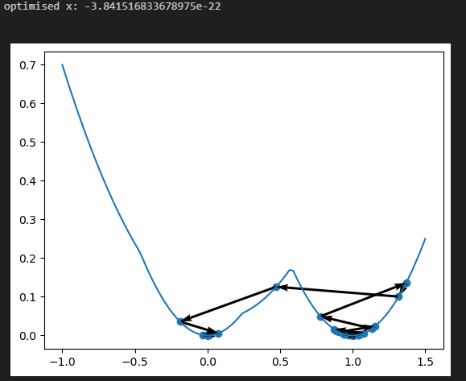

# how-SGD-selects-global-minima-LeiWu2018

_WORK IN PROGRESS!_

Implementation and explanation of the paper "How SGD Selects the Global Minima in Over-parameterized Learning: A Dynamical Stability Perspective", NeurIPS 2018 by Lei Wu, Chao Ma and Weinan E ([link to the paper](https://proceedings.neurips.cc/paper/2018/file/6651526b6fb8f29a00507de6a49ce30f-Paper.pdf)).

